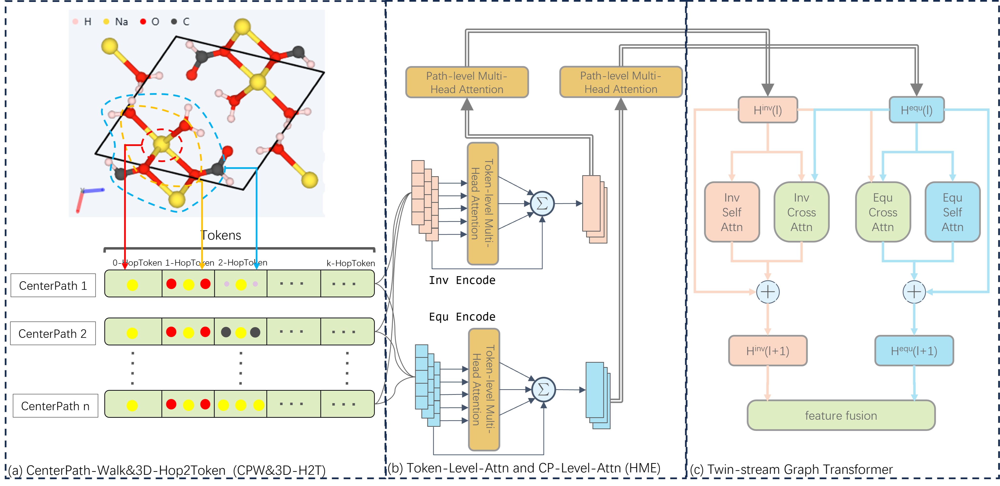

# HT-GeoGT: A Hierarchical Twin-stream Geometric Graph Transformer with graph representation learning architecture
This repository is the official implementation of “[HT-GeoGT: A Hierarchical Twin-stream Geometric Graph Transformer with graph representation learning architecture](https://www.sciencedirect.com/science/article/abs/pii/S030645732500353X)”, based on the official implementation of [NAGPHORMER](https://arxiv.org/abs/2206.04910) and [Geoformer](https://papers.nips.cc/paper_files/paper/2023/hash/aee2f03ecb2b2c1ea55a43946b651cfd-Abstract-Conference.html) in PyTorch.

> HT-GeoGT: A Hierarchical Twin-stream Geometric Graph Transformer with graph representation learning architecture
>
> *Zhijian Hong, Jian Li*, Linfei Sun, Guanjun Liu*

## Overview

